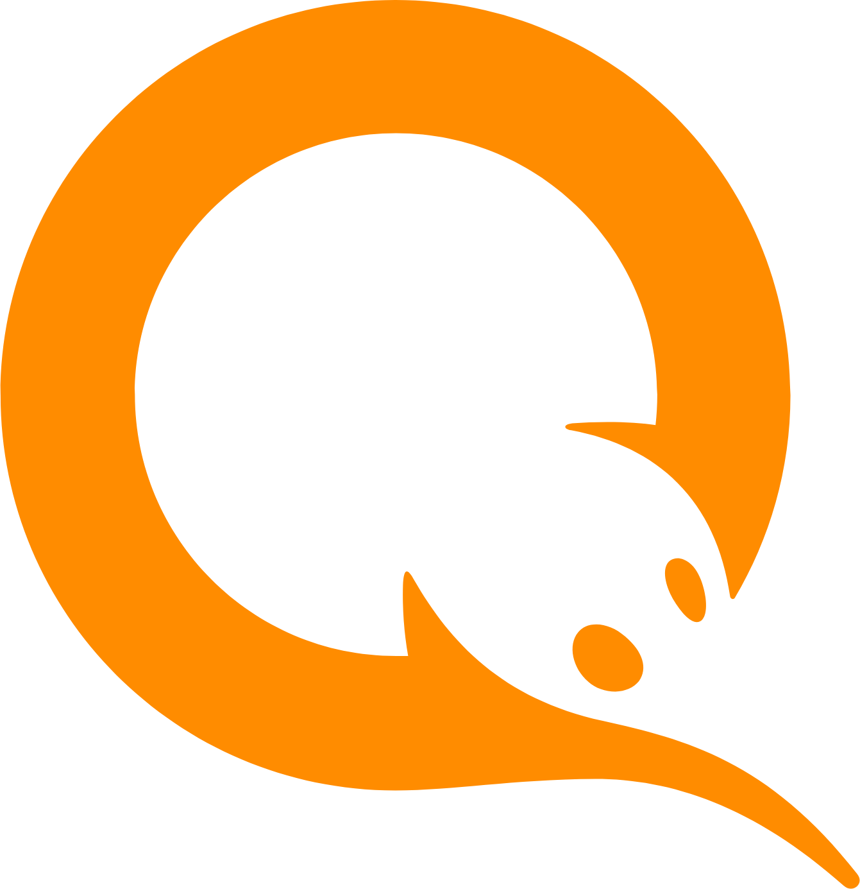

<link href="https://cdnjs.cloudflare.com/ajax/libs/font-awesome/6.5.0/css/all.min.css" rel="stylesheet">

<section class="intro">
<h1>  Арсентий Карпов <i class="fas fa-battery-full"></i></h1>
<h2 class="roles">
Android Developer <i class="fa-brands fa-android"></i>
&nbsp;|&nbsp; Fullstack <i class="fa-solid fa-layer-group"></i>
&nbsp;|&nbsp; Teamlead <i class="fa-solid fa-users-gear"></i>
</h2>
</section>
</strong>

<strong>Telegram: </strong><a href="https://t.me/arsengizer" style="color: #2d8f2d;">@arsengizer</a>

<strong>Email: </strong><a href="mailto:arsentiy.karpov@gmail.com" style="color: #2d8f2d;">arsentiy.karpov@gmail.com</a>

<strong>Web: </strong><a href="https://quine.life" style="color: #2d8f2d;">https://quine.life</a>

<strong>LinkedIn: </strong><a href="https://www.linkedin.com/in/arsentiy-karpov-4171a859" style="color: #2d8f2d;">https://www.linkedin.com/in/arsentiy-karpov-4171a859</a>

Telegram

 Email

LinkedIn

**iwi Кошелек**.(2013-->2024)

Android-разработчик → Тимлид Android-команды

**Статус:** [Приложение по-прежнему доступно в Google Play](https://play.google.com/store/apps/details?id=ru.mw&hl=en-US),  несмотря на отзыв банковской лицензии в 2024 году  

Как Android-разработчик, прошёл путь от Loaders и AsyncTask через все версии RxJava и сегодня использую Kotlin Multiplatform

###### Ключевые достижения

- Присоединился к Qiwi в марте 2013 года как второй Android-разработчик
- Участвовал в создании и выпуске первых версий Qiwi Wallet
- В 2016 году стал тимлидом Android-команды
- Руководил группой разработки 15 человек
- Заменторил 6 стажеров до уровня senior

######  Visa payWave (Бесконтактные платежи)

- Реализовал поддержку Visa payWave с использованием Host Card Emulation (HCE)
- Разработал весь протокол взаимодействия [смартфон] <-> [POS-терминал] с нуля
- В приложении можно было выпускать токенизированную карту и оплачивать через NFC
- Решение стало одним из первых на российском рынке

######  Совесть (Кредитная/лояльностная карта)

- Создали  версию приложения Совесть для агентов
- Продукт впоследствии выделился в отдельную команду и направление

######  Qiwi Investor

- Разработали первую кроссплатформенную версию Qiwi Investor
- Использовали библиотеку J2ObjC для общего бизнес-слоя

######  Интеграция Device Farm

- Внедрил Device Farm на базе Kubernetes в процессы CI/CD, чем ускорил Time to market в 10 раз
- Представил кейс на  [Qiwi Android Developer Days](https://www.youtube.com/watch?v=_DBV36UJBaI)

######  SDK Чата Поддержки

- Разработали несколько версий SDK:
  - SDK без UI
  - Полноценный SDK с UI
  - Кроссплатформенные SDK на Kotlin Multiplatform для Android и iOS

######  Цифровой рубль (CBDC)

- Работал над первой версией проекта Цифрового рубля (CBDC) внутри Qiwi Wallet
- Использовали Kotlin Multiplatform для общей кодовой базы

######  До Qiwi

- Разработчик на C++ в ГосНИИ АС
- JavaScript-разработчик в интеграторе Salesforce — компании «Мастердата»

######  Образование

Московский авиационный институт  
Специалист в области информационных технологий (2005 → 2011)

#####  Инженерный подход

######  Умею работать в разном темпе

- Комфортно чувствую себя при работе с жёсткими дедлайнами — даже на проектах с миллионами пользователей
- Столько же уверенно подхожу к задачам вдумчиво, если важны качество кода и устойчивость.
- Имею опыт работы с A/B тестированием, [trunk-based development](https://trunkbaseddevelopment.com/) и мониторингом после релиза
- Знаю, как быстро откатить или выключить фичу, если это необходимо

######  Выбираю инструменты осознанно

- Использую современные технологии — RxJava, Kotlin Multiplatform, Dagger — когда они действительно нужны проекту
- Но также знаю, что иногда достаточно WebView с парой хаков, чтобы запустить продукт быстро
- Моя цель — использовать оптимальный инструмент, а не самый модный или сложный

######  Понимаю сложные решения — и когда от них отказаться

- Работал с Device Farm на Kubernetes, сложными CI/CD пайплайнами и системами мониторинга в продакшене
- Но также понимаю ситуации, когда один скрипт и один стажер дают лучший результат

#####  Безопасность и DevOps

######  Безопасность приложений

Работая над крупным финтех-продуктом, невозможно обойтись без внимания к безопасности.  
На всех этапах разработки тесно взаимодействовал с командой AppSec

- Создал челлендж Capture The Flag для митапа [Qiwi Android Developer Days](https://www.youtube.com/watch?v=NvSvRdzu6H4)
- Имею практический опыт работы с Frida (Android) и Ghidra (iOS) для анализа безопасности и реверс инжиниринга

######  DevOps и инфраструктура

В последние годы я также активно занимался DevOps-направлением в мобильной разработке:

- Настроил и внедрил Device Farm на Kubernetes для автоматизированного тестирования
- Реализовал CI/CD процессы с помощью Tekton Pipelines, Argo CD и Ansible
- Работал с инструментами мониторинга: Grafana и Kibana

