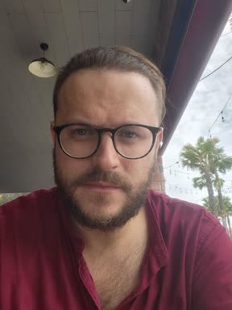

# Арсентий Карпов (12.08.1988)
### Android Developer / Teamlead

web: [karpov.cloud](https://karpov.cloud) 
telegram: [@arsengizer](https://t.me/arsengizer)

Как **Android разработчик** прошел путь от [Loaders и AsyncTask](https://developer.android.com/reference/android/os/AsyncTask) до [Kotlin Multiplatform](https://www.jetbrains.com/kotlin-multiplatform/), через все версии [RxJava](https://github.com/ReactiveX/RxJava).
**Умею**

- Запускать быстро, на коленке, с дедлайном "вчера' на миллионы пользователей.

- Запускать медленно, вдумчиво.

- С A/B тестами и [trunk based development](https://trunkbaseddevelopment.com/).

- С пост-релизным мониторингом и возможностью быстрого отката/переключения фичей продукта.

**Примерно точно иногда**

- Прикидываю, когда имеет смысл тащить в проект RxJava, Kotlin Multiplatform, Dagger и прочие -свистоперделки- современные мощные технологии, а когда для запуска продукта достаточно одного WebView с парой хаков.

**Понимаю и прощаю**

- Когда нужна ферма устройств на Kubernetes со сложной схемой CI/CD.
- Когда достаточно одного стажера и небольшого скрипта в репозитории в качества CI/CD.

Последние пару лет интересуют около **DevOps** темы c его **Kubernetes, Argo CD, Tekton piplines, ГрафанаКибана etc.**. Поднял в Qiwi ферму устройств на Kubernetes. Tekton piplines через ArgoCD (Ansible).

**Отвечая за крупный финтех продукт** необходимо помнить о безопасности приложения. С **Application Security** долго движемся бок о бок. **Разработал CTF [Capture The Flag]** для конференции [Qiwi Android Developer Days](https://www.youtube.com/watch?v=NvSvRdzu6H4).

------

**Qiwi Кошелек**
[Все ещё есть в сторе](https://play.google.com/store/apps/details?id=ru.mw&hl=en-US)

- В марте 2013 года присоединился вторым участником в состав команды Android разработки Qiwi, где начал разрабатывать первые версии Киви Кошелька.

- С 2016 стал "играющим" тимлидом Android команды Qiwi.

**Сервис бесконтактной оплаты Visa payWave**

- Реализовал внутри Qiwi Кошелька функционал бесконтактной оплаты Visa PayWave при помощи технологии Host Card Emulation без использования Visa SDK, с 0 реализовал протокол [телефон] <---> [POS терминал].  В приложении можно было выпускать токенизированную карту и платить телефоном по  NFC через POS терминал. Первое решение на Российском рынке на тот момент.

**Совесть. Карта рассрочки.**

- Разработал первую версию приложения карты рассрочки Совесть.
- Далее Совесть отделилась в новое АО со своей группой разработки.

**Qiwi Инвестор**

- Разработал первую версию кроссплатформенного приложения для инвестиций Qiwi Инвестор. В качестве кроссплатформенной библиотеки использовали [J2ObjC](https://github.com/google/j2objc).

**Ферма устройств**

- Интегрировал ферму устройств в процессы CI/CD. О чем рассказал на конференции [Qiwi Android Developer Days](https://www.youtube.com/watch?v=_DBV36UJBaI)

**Платформа Чата поддержки Qiwi**

- SDK только клиент (без UI)
- SDK c UI
- Кроссплатформенные версии всех SDK Android/Ios [Kotlin Multiplatform](https://www.jetbrains.com/kotlin-multiplatform/)

**Цифровой Рубль**

- Разработал первую версию кроссплатформенного проекта Цифрового Рубля.
- Кроссплатформенная библиотека [Kotlin Multiplatform](https://www.jetbrains.com/kotlin-multiplatform/)

До Qiwi (до 2013 г.) разрабатывал на C++ в ГосНИИАс и на JS в Salesforce интеграторе "МастерДата".
Высшее образование: Московский Авиационный Институт (МАИ). 2005 - 2011 гг.

------

**Random facts**

- 12 лет музыкальной школы. Фортепиано и ударные инструменты. Люблю поиграть и пописать музыку.
- Полтора года поддерживал j2me (Java 1.2) приложение и разрабатывал на его основе приложение-обертку под девайс Nokia Asha.
- Возбуждаюсь от NeoVim, Arch Linux, Hyprlane.
- Был домашний питомец -- попугай Ара (огромный такой).
- Есть рабочий телефон Jolla на Sailfish OS от финской компании. Два Blackberry. Два Samsung Fold.
- Женат, дочка 1 год:) На свадьбу написал мобильное приложение, с 2015 года лежит в открытом репозитории, но код лучше не смотреть.
- Cертификат MBA от PwC 2022 года.
- Сертификат Domain Driven Design от Luxsoft 2019 года.
